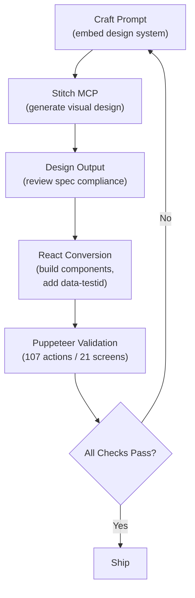

## 21 AI-Generated Screens, Zero Figma Files

*Agentic Development: 10 Lessons from 8,481 AI Coding Sessions*

I described an entire web application in plain English. The AI generated 21 production screens -- with components, design tokens, and validation -- in a single session. No Figma. No hand-written CSS. No designer in the loop.

This is not a prototype. It is a complete brutalist-cyberpunk web application with 47 design tokens, 5 component primitives, 4 example compositions, and a 107-action Puppeteer validation suite that proves every screen renders correctly.

This is post 10 of 11 in the Agentic Development series. The companion repo is at [github.com/krzemienski/stitch-design-to-code](https://github.com/krzemienski/stitch-design-to-code). Everything quoted here is real code from that repo.

---

### The Workflow

The cycle looks deceptively simple:

1. Craft a text prompt with the design system embedded
2. Feed it to Stitch MCP (an AI design generation tool)
3. Review the visual output for spec compliance
4. Convert to React components with `data-testid` attributes
5. Run Puppeteer validation against all 21 screens
6. If anything fails, go back to step 1



The critical insight, learned the hard way: the prompt must contain the complete design system every single time. Not "see previous specs." Not "same as before." The full token set, repeated verbatim, in every prompt for every screen. Context window drift is real, and it manifests as subtle visual inconsistencies across screens generated in the same session.

---

### The Design Token System

Every visual decision in the application is derived from 47 tokens defined in a single JSON file. Here is the brutalist-cyberpunk palette:

```javascript
// From: design-system/tokens.json

{
  "colors": {
    "background": "#000000",
    "primary": "#e050b0",
    "secondary": "#4dacde",
    "surface": "#111111",
    "surfaceAlt": "#1a1a1a",
    "surfaceHover": "#222222",
    "text": "#ffffff",
    "textSecondary": "#a0a0a0",
    "textMuted": "#606060",
    "border": "#2a2a2a",
    "borderAccent": "#3a3a3a",
    "success": "#22c55e",
    "warning": "#f59e0b",
    "error": "#ef4444",
    "primaryGlow": "rgba(224, 80, 176, 0.3)",
    "secondaryGlow": "rgba(77, 172, 222, 0.3)"
  }
}
```

Pure black background. Hot pink primary accent. Cyan secondary. No gray area -- literally. The surface colors step from `#111111` to `#1a1a1a` to `#222222` in tight increments, creating depth through value rather than hue.

But the most distinctive design decision lives in the border radius tokens:

```javascript
// From: design-system/tokens.json

"borderRadius": {
  "none": "0px",
  "sm": "0px",
  "base": "0px",
  "md": "0px",
  "lg": "0px",
  "xl": "0px",
  "2xl": "0px",
  "full": "0px"
}
```

Every single border radius value is `0px`. Not "mostly square with some rounding." Zero. Everywhere. This is not laziness -- it is a deliberate brutalist design choice. When components from shadcn/ui reference `borderRadius.md` or `borderRadius.lg`, they resolve to `0px`. The token system enforces the aesthetic at the configuration layer, not the component layer.

Typography is equally opinionated. One font family everywhere:

```javascript
// From: design-system/tokens.json

"typography": {
  "fontFamily": "JetBrains Mono, monospace",
  "fontFamilyFallback": "Courier New, Courier, monospace"
}
```

JetBrains Mono for headlines, body copy, buttons, labels, navigation -- everything. Combined with the `0px` border radius, this produces an aggressive terminal-aesthetic that looks like nothing else in the React ecosystem.

These tokens flow into Tailwind via a preset that maps every token to a utility class:

```javascript
// From: design-system/tailwind-preset.js

const tokens = require('./tokens.json');

const preset = {
  theme: {
    extend: {
      colors: {
        background: tokens.colors.background,
        primary: {
          DEFAULT: tokens.colors.primary,
          glow: tokens.colors.primaryGlow,
          subtle: tokens.colors.primarySubtle,
        },
        secondary: {
          DEFAULT: tokens.colors.secondary,
          glow: tokens.colors.secondaryGlow,
          subtle: tokens.colors.secondarySubtle,
        },
        surface: {
          DEFAULT: tokens.colors.surface,
          alt: tokens.colors.surfaceAlt,
          hover: tokens.colors.surfaceHover,
        },
      },
      fontFamily: {
        mono: [tokens.typography.fontFamily, tokens.typography.fontFamilyFallback],
        sans: [tokens.typography.fontFamily, tokens.typography.fontFamilyFallback],
      },
      borderRadius: {
        none: tokens.borderRadius.none,
        sm: tokens.borderRadius.sm,
        DEFAULT: tokens.borderRadius.base,
        md: tokens.borderRadius.md,
        lg: tokens.borderRadius.lg,
        xl: tokens.borderRadius.xl,
        '2xl': tokens.borderRadius['2xl'],
        full: tokens.borderRadius.full,
      },
    },
  },
};
```

Notice: `fontFamily.sans` maps to JetBrains Mono. Even when components use Tailwind's `font-sans` class, they get the monospaced font. The design system is inescapable.

The preset also defines custom background gradients that use the primary and secondary colors at low opacity:

```javascript
// From: design-system/tailwind-preset.js

backgroundImage: {
  'primary-gradient': `linear-gradient(135deg, ${tokens.colors.primary}20 0%, transparent 60%)`,
  'hero-gradient': `radial-gradient(ellipse at top, ${tokens.colors.primary}15 0%, transparent 60%), radial-gradient(ellipse at bottom right, ${tokens.colors.secondary}10 0%, transparent 50%)`,
  'grid-pattern': `linear-gradient(${tokens.colors.border} 1px, transparent 1px), linear-gradient(90deg, ${tokens.colors.border} 1px, transparent 1px)`,
},
```

That `grid-pattern` utility creates a subtle wire-grid background that reinforces the terminal aesthetic. One line in the config, reusable across every screen.

---

### The Component Layer

The Button component demonstrates how CVA (Class Variance Authority) combines with the token system to produce a flexible, type-safe component API. Eight variants, eight sizes, `forwardRef`, Radix Slot for composition:

```tsx
// From: components/ui/button.tsx

const buttonVariants = cva(
  // Base styles
  [
    'inline-flex items-center justify-center gap-2',
    'font-mono text-sm font-semibold',
    'border-0 outline-none',
    'transition-all duration-150',
    'cursor-pointer select-none',
    'disabled:pointer-events-none disabled:opacity-50',
    'focus-visible:ring-2 focus-visible:ring-primary focus-visible:ring-offset-2 focus-visible:ring-offset-background',
    // Brutalist — no border radius anywhere
    'rounded-none',
  ].join(' '),
  {
    variants: {
      variant: {
        /** Hot pink fill — primary CTA */
        default: [
          'bg-primary text-black',
          'hover:bg-[#c040a0] hover:shadow-[0_0_20px_rgba(224,80,176,0.4)]',
          'active:scale-[0.98] active:bg-[#b03090]',
        ].join(' '),

        /** Cyan outline */
        'secondary-outline': [
          'border border-secondary text-secondary bg-transparent',
          'hover:bg-secondary hover:text-black hover:shadow-[0_0_16px_rgba(77,172,222,0.3)]',
          'active:scale-[0.98]',
        ].join(' '),

        /** Ghost — subtle surface hover */
        ghost: [
          'bg-transparent text-text-secondary',
          'hover:bg-surface hover:text-text',
          'active:scale-[0.98]',
        ].join(' '),
      },

      size: {
        xs: 'h-7 px-2 text-xs',
        sm: 'h-8 px-3 text-xs',
        default: 'h-10 px-4 text-sm',
        lg: 'h-12 px-6 text-base',
        xl: 'h-14 px-8 text-lg',
        icon: 'h-10 w-10 p-0',
        'icon-sm': 'h-8 w-8 p-0',
        'icon-lg': 'h-12 w-12 p-0',
      },
    },
  }
);
```

The hover effects are where the brutalist aesthetic comes alive. The primary button gets a hot pink glow on hover -- `shadow-[0_0_20px_rgba(224,80,176,0.4)]`. The secondary-outline variant gets a cyan glow. Combined with the sharp `0px` corners and JetBrains Mono text, these glow effects create a cyberpunk UI that feels like interacting with a terminal from the future.

The component supports Radix Slot for composition, a loading state with an inline spinner, and proper `aria-disabled` handling:

```tsx
// From: components/ui/button.tsx

const Button = React.forwardRef<HTMLButtonElement, ButtonProps>(
  ({ className, variant, size, asChild = false, loading = false, children, disabled, ...props }, ref) => {
    const Comp = asChild ? Slot : 'button';

    return (
      <Comp
        ref={ref}
        className={cn(buttonVariants({ variant, size }), className)}
        disabled={disabled || loading}
        aria-disabled={disabled || loading}
        {...props}
      >
        {loading ? (
          <>
            <LoadingSpinner />
            <span className="opacity-70">{children}</span>
          </>
        ) : (
          children
        )}
      </Comp>
    );
  }
);
```

This is one button component. There are 5 total component primitives (Button, Card, Input, Tabs, Badge) and 4 example compositions (HomeHero, ResourceCard, AuthForm, AdminTabs). From these 9 building blocks, 21 screens are constructed.

---

### The Validation Suite

This is where most AI design workflows fall apart. You generate beautiful screens, manually eyeball them, declare victory, and ship something that breaks in production. The stitch-design-to-code approach replaces eyeballing with 107 programmatic Puppeteer actions across all 21 screens.

The checks are defined declaratively:

```javascript
// From: validation/puppeteer-checks.js

{
  name: 'home-design-tokens',
  route: '/',
  actions: [
    { type: 'navigate', expected: 200 },
    {
      type: 'evaluate',
      expected: () => {
        const body = document.body;
        const bg = window.getComputedStyle(body).backgroundColor;
        return bg === 'rgb(0, 0, 0)';
      },
    },
  ],
},
```

That check validates that the home page background is literally `rgb(0, 0, 0)` -- pure black, as specified in the design tokens. Not "dark enough." Not "looks black." Computationally verified pure black.

The suite covers 7 action types: `navigate` (HTTP status checks), `screenshot` (visual capture), `waitForSelector` (DOM presence), `assert` (visibility), `evaluate` (arbitrary JS assertions), `click` (interaction), and `fill` (form input). Here is a form interaction check:

```javascript
// From: validation/puppeteer-checks.js

{
  name: 'login-form-fill',
  route: '/auth/login',
  actions: [
    { type: 'navigate', expected: 200 },
    { type: 'fill', selector: '[data-testid="email-input"]', value: 'test@example.com' },
    { type: 'fill', selector: '[data-testid="password-input"]', value: 'password123' },
    { type: 'screenshot', screenshot: 'login-filled.png' },
  ],
},
```

And here is one that validates the admin dashboard has at least 20 tabs:

```javascript
// From: validation/puppeteer-checks.js

{
  name: 'admin-tab-count',
  route: '/admin',
  actions: [
    { type: 'navigate', expected: 200 },
    { type: 'waitForSelector', selector: '[data-testid="admin-tabs"]' },
    { type: 'evaluate', expected: () => document.querySelectorAll('[data-testid^="tab-"]').length >= 20 },
  ],
},
```

The validation runner executes checks sequentially (for deterministic screenshots), reports pass/fail with timing, and writes a JSON report:

```javascript
// From: validation/run-validation.js

for (let i = 0; i < filteredChecks.length; i++) {
  const check = filteredChecks[i];
  const progress = `[${String(i + 1).padStart(2, '0')}/${filteredChecks.length}]`;
  process.stdout.write(`  ${progress} ${check.name.padEnd(40, '.')} `);

  const result = await runCheck(browser, check);
  results.push(result);

  if (result.status === 'pass') {
    process.stdout.write(`\x1b[32mPASS\x1b[0m (${result.duration}ms)\n`);
  } else {
    process.stdout.write(`\x1b[31mFAIL\x1b[0m (${result.duration}ms)\n`);
  }
}
```

The distribution across screen groups:

| Screen Group | Checks |
|---|---|
| Public screens (Home, Resources, Search, About, Categories x2, Resource Detail) | 36 |
| Auth screens (Login, Register, Forgot Password) | 14 |
| User screens (Profile, Bookmarks, Favorites, History) | 18 |
| Admin screens (Admin Dashboard with 20 tabs, Suggest Edit) | 29 |
| Legal screens (Privacy Policy, Terms of Service) | 8 |
| **Total** | **105 checks across 107 actions** |

The Admin Dashboard alone has 25 checks -- one per tab plus KPI card validation. When you have a 20-tab admin interface, you cannot visually verify all 20 tabs by hand every time you make a change. The Puppeteer suite clicks each tab, waits for the content to render, and screenshots the result. Every time.

---

### The Branding Bug

Here is the most instructive failure from the entire project. During generation, Stitch MCP started producing screens with the product name "Awesome Video Dashboard" instead of the correct name "Awesome Lists." The substitution happened at screen 1 and propagated to 8 screens before it was caught.

The root cause analysis from the branding checklist:

```javascript
// From: docs/branding-checklist.md

## Why It Happens in AI Workflows

### 1. Context Window Drift
When generating multiple screens in a long session (21+ screens),
the AI model's "attention" to early instructions diminishes. The
product name specified in the first prompt may be remembered less
faithfully by the 15th screen generation.

### 2. Training Data Default Patterns
AI models have seen millions of example UIs with placeholder names
like "Awesome App," "My Dashboard," "Video Platform." When the
specific product name isn't prominent in the prompt, the model
falls back to these common patterns.

### 3. Semantic Similarity Substitution
"Awesome Lists" and "Awesome Video Dashboard" share the word
"Awesome." The model sometimes pattern-matches on the adjective
and completes with a more "common" noun phrase from its training data.
```

The fix is treating branding as a first-class design token, not as free text scattered across prompts. The branding checklist proposes adding brand tokens to the design system:

```javascript
// From: docs/branding-checklist.md

{
  "brand": {
    "name": "Awesome Lists",
    "tagline": "The Ultimate Curated Resource Directory",
    "domain": "awesomeLists.dev",
    "copyrightHolder": "Nick Krzemienski"
  }
}
```

And then injecting them programmatically via a prompt builder, so the correct product name is never dependent on human memory or AI attention span.

The automated prevention is a simple grep:

```bash
grep -rn "Video Dashboard\|Placeholder\|lorem ipsum" src/ components/ app/
```

Run this after every generation session. Add it as a prebuild script. The branding bug is a procedural problem, not a technical one. The AI is perfectly capable of using the correct product name -- it just needs to be told explicitly, every time, in every prompt.

---

### The Prompt Engineering Pattern

Every screen prompt follows the same structure: product name in the first sentence, full design system spec inline, layout description, and key elements list. This pattern worked for all 21 screens:

```
Design a [SCREEN NAME] for "Your Product" -- [one-line description].

DESIGN SYSTEM:
- Background: #000000 (pure black)
- Primary Accent: #e050b0 (hot pink)
- Secondary Accent: #4dacde (cyan)
- Surface/Card: #111111 background, #1a1a1a elevated
- Text: #ffffff primary, #a0a0a0 secondary
- Font: JetBrains Mono, monospaced, used everywhere
- Border radius: 0px -- brutalist aesthetic
- Component library: shadcn/ui
- Borders: 1px solid #2a2a2a

LAYOUT:
[Describe structure here]

KEY ELEMENTS:
[List all UI elements with specifics]
```

The redundancy is intentional. Yes, the design system spec is identical across all 21 prompts. Yes, it increases token usage. But it eliminates context window drift entirely. The 15th screen generation has the same design fidelity as the 1st because it has the same context.

---

### The Numbers

| Metric | Value |
|---|---|
| Screens generated from text descriptions | 21 |
| Design tokens governing every visual decision | 47 |
| Puppeteer validation actions | 107 (374 individual assertions within those actions) |
| shadcn/ui component primitives | 5 |
| Example compositions | 4 |
| Button variants / button sizes | 8 / 8 |
| Figma files opened | 0 |
| Lines of hand-written CSS | 0 |
| Session transcript lines | ~13,432 |
| Branding bugs caught, documented, and solved | 1 |

---

### What the Remaining Challenges Look Like

The interesting conclusion from this project: the remaining challenges are procedural, not technical.

The AI can generate production-quality React components from text descriptions. It can apply design tokens consistently. It can produce 20-tab admin dashboards with proper `data-testid` attributes. The technology works.

What does not work yet is the process around the technology. Branding drift requires explicit prevention. Long sessions require redundant context. Validation requires deliberate `data-testid` architecture planned before generation, not added after. These are workflow problems, not capability problems.

The gap between "AI can generate UI" and "AI reliably generates the right UI" is entirely a prompt engineering and validation infrastructure gap. Stitch MCP handles the generation. Puppeteer handles the validation. The hard part -- the part this repo documents -- is everything in between: the token system that constrains the design space, the prompt structure that ensures consistency, the branding safeguards that prevent drift, and the validation suite that proves correctness.

Companion repo: [github.com/krzemienski/stitch-design-to-code](https://github.com/krzemienski/stitch-design-to-code)

---

*Part 10 of 11 in the [Agentic Development](https://github.com/krzemienski/agentic-development-guide) series.*
